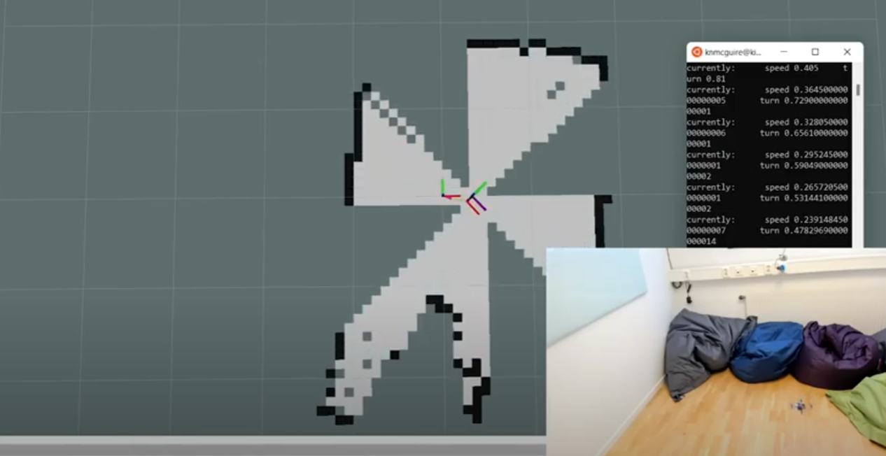

# crazyflie_ros2_experimental


This is my Bitcraze Summer project of 2022! Purpose: To use ROS2 to implement SLAM and navigation with the [Crazyflie](https://www.bitcraze.io/products/crazyflie-2-1/), [Flow deck](https://www.bitcraze.io/products/flow-deck-v2/) and [Multiranger](https://www.bitcraze.io/products/multi-ranger-deck/), on both the real drone and simulation. 

This is very much in progress but I'm excited to work on this and very confident that this will work at the end. Also this is a good opertunity for me to show an ROS2 implementation of a new platform from scratch, so why not start with the Crazyflie :)

See this [Blogpost](https://www.bitcraze.io/2022/07/crazyflie-summer-project-with-ros2-and-mapping/) explaining the bulk of the current process.


## Goal

Pretty much this:


... but with a map generated while doing it, and using navigate with it. And... being able to do this on a real Crazyflie too! How hard can it be? :D

But no seriously, I hope to at least get the SLAM mapping toolbox to work by the end of the summer 2022, and from there it is an ongoing project that can pretty much go on. If we got something working and stable, it could be part of an official Crazyflie_ROS2 package that we release in the future. Also it would be great to show these with existing packages like [SLAM_toolbox](https://github.com/SteveMacenski/slam_toolbox) or [NAV2](https://github.com/ros-planning/navigation2).

For now this project is on my personal github repo for now and once there is something solid working it will be probably transfered to the [Bitcraze Github organization](https://github.com/bitcraze/).

## Current Status

Currently the simple_mapper node works on a real crazyflie what is controllable through twist messages.

Check this video
[](https://youtu.be/_naBMmCv868)  

## Explanation per package
- crazyflie_ros2: The Crazyflie package that has contact with the Crazyflie directly and publishes the transforms
- crazyflie_ros2_description: The package that handles the RVIZ screen and also includes meshes if necessary
- crazyflie_ros2_simulation: A webots simulator world and ROS node controller (based on the experimental [bitcraze simulation repo](https://github.com/bitcraze/crazyflie-simulation))
- crazyflie_ros2_slam: Using an existing SLAM toolbox to create a map
- crazyflie_ros2_simple_mapper: An own made simple mapper functionality for multirangers and flowdeckbased odometry
- ... more to come (check [planning](#planning))


## How to run

First go to your development workspace and run:

    source /opt/ros/galactic/local_setup.bash
    colcon build
    source install/setup.bash


### Real Crazyflie with simple mapper
You will need an [STEM ranging bundle](https://store.bitcraze.io/collections/bundles/products/stem-ranging-bundle) for this...

    ros2 launch crazyflie_ros2_simple_mapper simple_mapper_real_launch.py 

### Simulated Crazyflie with simple mapper
First install [webots 2022a](https://www.cyberbotics.com/)

    ros2 launch crazyflie_ros2_simple_mapper simple_mapper_simulation_launch.py 

### RVIZ2 + Control

Start RVIZ2 by typing

    rviz2
    
and select the map visualization

You can control both the simulated and real crazyflie with twist messages:

    ros2 run teleop_twist_keyboard teleop_twist_keyboard

## Planning
- ~~Make a publish ROS2 node for crazyflie (with [cflib](https://github.com/bitcraze/crazyflie-lib-python)) to publish pose and transform~~
- ~~Make crazyflie description package with RVIZ visualization file and crazyfie robot mesh~~
- ~~Make crazyflie_ros2_slam node starting with the slam_toolbox's parameters~~
- ~~Connect crazyflie_ros node to the crazyflie_ros2_node and generate an map with Rviz (needs tuning in simulation first~~
- ~~Make crazyflie_ros2_simulation package with Webots~~
- ~~Turn the[ multiranger pointcloud](https://github.com/bitcraze/crazyflie-lib-python/blob/master/examples/multiranger/multiranger_pointcloud.py) example into a rosnode equivalent (crazyflie_ros2_simple_map)~~
- ~~Have simulator run in simple mappingnode~~
- ~~Have real crazyflie fly in simple mapper node~~
- Connect webots simulation to the SLAM toolbox
- In Simulation tune the SLAM toolbox to work for 4 laser rangers (if possible)
- If tunable, try out on real crazyflie + multiranger
- Make a NAV2 package that can do something with the map
- Make 3d mapping vizualization 
- Implement wall following?
- If available, use python bindings of the Crazyflie's onboard EKF 
- Try out new multi-zone multiranger deck

### Issues to solve
- crazyflie_ros needs to publish odometry messages properly
- replace manual crazyflie robot after webot's release


## Some handy things for me to remember:


For installing cflib as an external dependency

```
sudo mkdir -p /usr/local/share/ros && sudo cp cflib-python.yaml /usr/local/share/ros
```

```
echo "yaml file:///usr/local/share/ros/cflib-python.yaml" | sudo tee -a /etc/ros/rosdep/sources.list.d/20-default.list
rosdep update
```
```
rosdep install --from-paths src --ignore-src -r -y 
```

WSL use
https://github.com/dorssel/usbipd-win/wiki/WSL-support

Run TF tree viewer

```
ros2 run rqt_tf_tree rqt_tf_tree --force-discover
```
Problem gui wsl https://github.com/microsoft/wslg/issues/554
```
LIBGL_ALWAYS_SOFTWARE=true
```
```
 ros2 launch slam_toolbox online_async_launch.py 
```